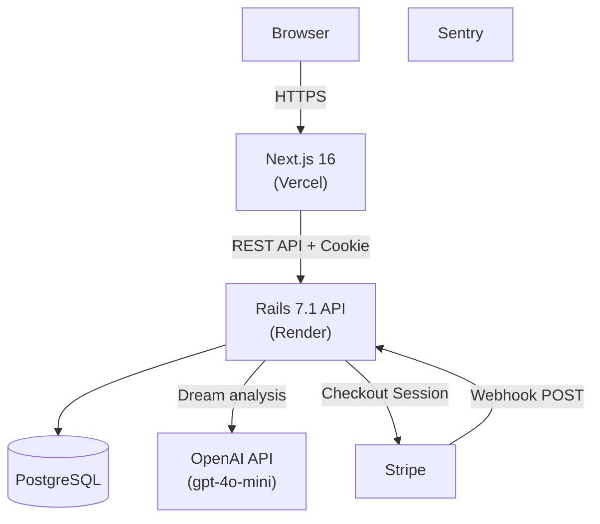

# 🌙 ユメログ — AI Dream Journal

**「言葉にならない子どもの夢や感情を、家族で楽しく記録・共有したい」** という課題から生まれた家族向け夢記録アプリです。  
夢の内容を記録すると、OpenAI API が分析文と感情タグを返し、言葉の発達段階にある子どもの気持ちを家族で振り返るきっかけを作ります。

[](https://github.com/isekaisaru/dream-journal-app/actions/workflows/e2e-test.yml)
[](https://github.com/isekaisaru/dream-journal-app/actions/workflows/backend-test.yml)
[](https://dreamjournal-app.vercel.app)

**🌐 本番URL:** https://dreamjournal-app.vercel.app

## 概要

ユメログは、夢の記録、感情タグの可視化、家族向けのやさしいUIを組み合わせた Web アプリです。  
フロントエンドは Next.js 16、バックエンドは Rails 7.1 API を採用し、認証、AI 連携、寄付導線、監視、テストまでを個人開発で一貫して構築しています。

技術選定では「モダンだから」ではなく、家族が毎日迷わず使える UX と、継続運用しやすい構成になるかを重視しています。

---

## 1. 解決する課題とプロダクト体験

### 夢の記録と感情の可視化

子どもでも扱いやすいよう、ひらがなを多めに使った表現やシンプルな入力導線を意識しています。  
記録した夢は OpenAI API（現在の実装では `gpt-4o-mini`）で分析し、短い解釈文と感情タグを返します。日々の夢を単なるメモで終わらせず、親子の会話やセルフケアのきっかけに変えることを狙っています。

### 認証と寄付導線

認証は JWT を HttpOnly Cookie で扱い、フロントエンドとバックエンドを分離した構成でも安全にセッションを維持できるようにしています。  
また、Stripe Checkout と Webhook を使った寄付導線を実装し、`checkout.session.completed` を受けて支払い結果を永続化するところまで含めて整備しています。

---

## 2. システムアーキテクチャと技術選定



### この構成を選んだ理由

- **フロントエンド: Next.js (App Router)**
  毎日使うアプリとして、初期表示の軽さと操作感の両立を重視しました。Server / Client Components を使い分けつつ、インタラクティブな UI は Framer Motion で補っています。
- **バックエンド: Rails API**
  認証、AI 連携、決済、Webhook 処理のようなドメインロジックを、短いサイクルで安全に改善しやすい構成として採用しました。RSpec による回帰確認もしやすい点を重視しています。
- **認証設計: JWT + HttpOnly Cookie**
  XSS 耐性を意識し、トークンをブラウザの JavaScript から直接触らせない構成にしています。クロスドメイン環境では Vercel 側の API 経由で Cookie を安定して扱えるようにしています。
- **インフラ: Vercel / Render**
  インフラ運用を過度に抱えず、機能改善と UX 検証に集中しやすいフルマネージド構成を選びました。

---

## 3. 設計・実装上の工夫

### ① 利用者フィードバック前提の UX 改善

「ひらがな中心の表示」「夢詳細の閲覧モードと編集モードの分離」「パスワード可視化トグル」など、使いながら分かりにくかった点を小さく改善してきました。  
個人開発でも変更を積み重ねやすいよう、Jest・RSpec・Playwright を併用して回帰確認しやすい状態を保っています。

### ② 多対多リレーションとレガシーデータ共存

夢と感情の関係は多対多で表現しています。さらに、AI 分析結果の保存形式が変わった後も既存データを壊さず扱えるよう、表示側で新旧フォーマットを吸収する実装にしています。

### ③ 監視とセキュリティを後回しにしない

Sentry をフロントエンドとバックエンドの両方に導入し、本番での例外や不安定な挙動を検知しやすくしています。  
加えて、CORS 設定、HttpOnly Cookie、環境変数管理など、派手ではないが運用上効く部分を優先して整えています。

### ④ Stripe 決済フローの堅牢化

寄付導線では、`ensure_stripe_customer_id!` による顧客再利用、Webhook 署名検証、重複イベントの排除、支払いログの構造化を実装しています。  
一次切り分け用に [`docs/runbook-payments.md`](docs/runbook-payments.md) も用意し、機能実装だけでなく運用時の対応手順まで残しています。

---

## 4. 今後の展望・課題

- N+1 の解消やクエリ改善など、データ量増加を見据えたバックエンド最適化
- 自動テストの拡充と、より安全な CI/CD の継続改善

---

## Tech Stack & Project Info

<details>
<summary>利用技術</summary>

- **Frontend**: Next.js 16, React 18, TypeScript, Tailwind CSS, Framer Motion
- **Backend**: Ruby on Rails 7.1 (API mode), Ruby 3.3, PostgreSQL
- **Testing**: Playwright, RSpec, Jest
- **AI / External Services**: OpenAI API (`gpt-4o-mini`, `whisper-1`), Stripe, Sentry
- **DevOps**: Vercel, Render, Docker Compose, GitHub Actions
</details>

<details>
<summary>ローカル開発環境の立ち上げ</summary>

```bash
git clone https://github.com/isekaisaru/dream-journal-app.git
cd dream-journal-app
cp backend/.env.example backend/.env
make dev-up
```

| Service | URL |
|---|---|
| Frontend | http://localhost:3000 |
| Backend API | http://localhost:3001 |
| PostgreSQL | localhost:5432 |
</details>

<details>
<summary>CI/CD</summary>

GitHub Actions で `main` への Push / PR 時に Playwright、RSpec、Jest を実行し、主要フローの回帰を検知できるようにしています。
</details>

---

## Author

**Tyougorou**  
物流・現場マネジメント経験を経て、手触りのあるソフトウェアで課題解決を行うため Web 開発技術を習得。要件定義から実装、デプロイ、運用改善まで一貫して取り組んでいます。
