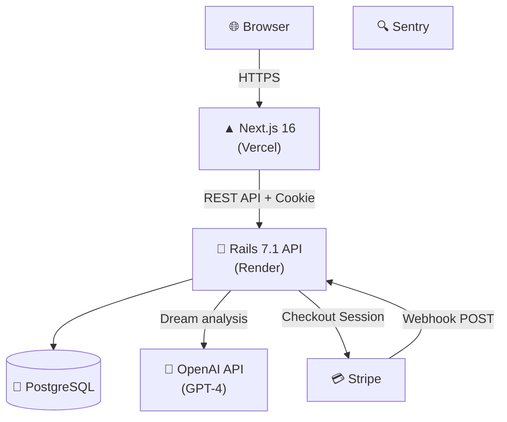

# 🌙 ユメログ — AI Dream Journal

> **毎朝の夢を、AIが分析・言語化してくれる家族向けセルフケアアプリ**
> *An AI-powered dream journal that captures, analyzes, and visualizes your inner world.*

[](https://github.com/isekaisaru/dream-journal-app/actions/workflows/e2e-test.yml)
[](https://github.com/isekaisaru/dream-journal-app/actions/workflows/backend-test.yml)
[](https://dreamjournal-app.vercel.app)

**🌐 本番URL:** https://dreamjournal-app.vercel.app

## 概要 (Overview)
ユメログは、言葉で説明しづらい「夢」を記録し、AIを用いて感情の可視化を行う家族向けのWebアプリです。
Next.js（App Router）+ Ruby on Rails API を用いて、認証、感情タグ、多対多リレーション、UI/UX改善、決済フロー、インフラ構築までを一貫して個人開発しています。
単なるモダン技術の羅列ではなく、**「なぜそのアーキテクチャ・設計にしたか」** というビジネス要件からの逆算を重視し、課題設定から改善まで継続的に取り組んでいます。

---

## 1. 解決する課題とプロダクト体験 (Features)

**「家族が毎日ストレスなく、直感的に記録できる」** ことを最優先にUI/UXを設計しています。

### 夢の記録と感情の可視化
子どもでも使えるよう平易な表現（ひらがな等）を活用。テキストで夢を記録すると、OpenAI GPT-4 が内容を分析し、隠れた感情パターンを可視化するセルフケアツールとして機能します。
> 📸 *Screenshot placeholder — `docs/screenshots/dream-log.png`*
> 📸 *Screenshot placeholder — `docs/screenshots/ai-analysis.png`*

### 堅牢な認証とSaaS課金フロー
JWT（HttpOnly Cookie）によるセキュアな認証と、Stripe Checkout（Webhook連動）を用いた本番グレードの寄付・フリーミアム機能を構築しています。
> 📸 *Screenshot placeholder — `docs/screenshots/auth.png`*
> 📸 *Screenshot placeholder — `docs/screenshots/donation.png`*

---

## 2. システムアーキテクチャと技術選定の理由 (Why)



### なぜこの技術を選定したか（Why）
- **フロントエンドとバックエンドの完全分離**
  家族が直感的に動かせるSPA的でリッチなUI（Next.js）を実現しつつ、複雑なデータリレーションや将来のビジネスロジック拡張（Rails）を堅牢に保つため分離アーキテクチャを採用しました。
- **フロントエンド: Next.js (App Router) / Tailwind CSS**
  モダンなルーティング機構と、Reactエコシステムを用いた高いレベルの画面コンポーネント設計を実践するため。
- **バックエンド API: Ruby on Rails (API mode)**
  要件からの高速なイテレーションを可能にし、堅牢なMVCフレームワークのアーキテクチャ設計を習得するため。
- **インフラ (Vercel / Render / Supabase)**
  フルスタック個人開発においては、インフラ運用コストを最小化し、プロダクトのコード記述とUX改善に集中できる「マネージドサービス（PaaS）」の組み合わせがビジネス的に最適解だと判断しました。

---

## 3. ビジネス要件から落とし込んだ「設計と実装」の工夫

### ① 拡張性を見据えたデータ設計（多対多リレーション）
「夢」と複数の「感情タグ」を結びつけるため、中間テーブルを用いた正規化を実施。データの整合性を担保しつつ、JSON形式のAPIレスポンスをフロントエンドが再利用しやすい形に整形して処理しています。

### ② 品質・UXへの責任（E2Eテストと改善起点の開発）
「いかにプロダクトの品質と信頼性を担保するか」を最重要視し、PlaywrightやRSpec、Jestによる自動テストとGitHub Actionsを構築しました。継続的に品質を高めるためのCI/CDの仕組みづくりに取り組んでいます。

### ③ Security & Observability（堅牢性と監視基盤）
JWTトークンはHttpOnly Cookieに格納し、フロントエンドからの漏洩を防止。また、Stripe Webhookの署名検証やCORSの厳格化による多層防御を実施しています。Sentryを導入し、例外発生時は構造化ログを用いてトリアージを迅速に行える監視体制を整備しました。

### ④ 実務を見据えた堅牢な決済フロー（Stripe Webhook）
単なるAPI呼び出しではなく、`ensure_stripe_customer_id!` による顧客状態の管理や、Webhookを用いた冪等（べきとう）処理など、決済システム特有の複雑なステート管理を本番環境で実装・稼働させています。

---

## 4. 今後の展望・課題
- N+1問題の撲滅など、ドメインモデルの成長とデータ量増加を見据えたバックエンドのパフォーマンス・チューニング。
- 自動テストカバレッジの拡充と、より安全なCI/CDパイプラインの本格運用。

---

## Tech Stack & Project Info (Appendix)

<details>
<summary>詳細な利用技術一覧</summary>

- **Frontend**: Next.js 16 (React 18), TypeScript, Tailwind CSS, Framer Motion
- **Backend**: Ruby on Rails 7.1 (API mode), Ruby 3.3, PostgreSQL
- **Testing**: Playwright (E2E), RSpec (Backend Unit/Request), Jest (Frontend Unit)
- **AI & 3rd Party**: OpenAI API (GPT-4), Stripe (Checkout & Webhooks), Sentry
- **DevOps**: Vercel, Render, Docker Compose, GitHub Actions
</details>

<details>
<summary>ローカル開発環境の立ち上げ手順 (Getting Started)</summary>

```bash
git clone https://github.com/isekaisaru/dream-journal-app.git
cd dream-journal-app
cp backend/.env.example backend/.env # 必須環境変数の入力
make dev-up
```
| Service | URL |
|---|---|
| Frontend | http://localhost:3000 |
| Backend API | http://localhost:3001 |
| PostgreSQL | localhost:5432 |
</details>

<details>
<summary>CI/CD構成と品質ゲート</summary>

GitHub Actionsを用いて、`main` ブランチへのPush/PR時に自動で各種テスト（Playwright, RSpec, Jest）を実行し、品質低下を防ぐパイプライン（E2E / Backend / Frontend）を構築しています。
</details>

---

## Author
**Tyougorou**
物流・現場マネジメント経験を経て、手触りのあるソフトウェアで課題解決を行うためWeb開発技術を習得。要件定義からデプロイ・運用まで、一連の開発工程に責任を持って取り組んできました。
