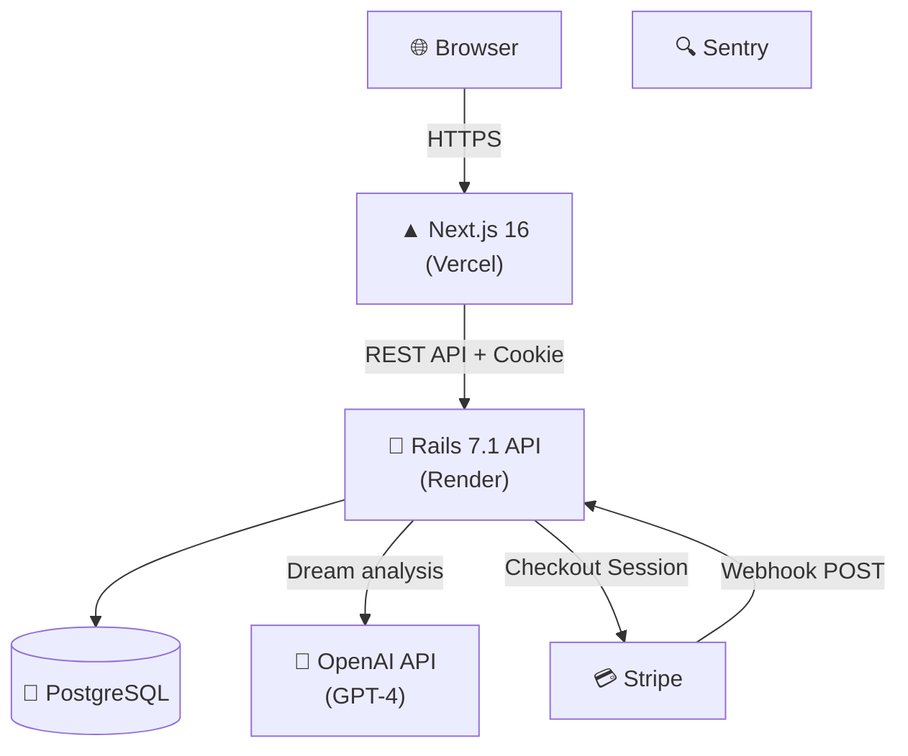

# 🌙 ユメログ — AI Dream Journal

**「言葉にならない子どもの夢や感情を、家族で楽しく記録・共有したい」** という課題から生まれた家族向け夢記録アプリです。
毎朝の不思議な夢を記録すると、OpenAIが内容を分析し感情タグで可視化。言葉の発達段階にある子どもの感情を紐解き、日々のセルフケアやご家族間のコミュニケーションのきっかけを作ります。

[](https://github.com/isekaisaru/dream-journal-app/actions/workflows/e2e-test.yml)
[](https://github.com/isekaisaru/dream-journal-app/actions/workflows/backend-test.yml)
[](https://dreamjournal-app.vercel.app)

**🌐 本番URL:** https://dreamjournal-app.vercel.app

## 概要 (Overview)
ユメログは、言葉で説明しづらい「夢」を記録し、AIを用いて感情の可視化を行う家族向けのWebアプリです。
Next.js（App Router）+ Ruby on Rails API を用いて、認証、感情タグ、多対多リレーション、UI/UX改善、決済フロー、インフラ構築までを一貫して個人開発しています。
単なるモダン技術の羅列ではなく、**「なぜそのアーキテクチャ・設計にしたか」** というビジネス要件からの逆算を重視し、課題設定から改善まで継続的に取り組んでいます。

---

## 1. 解決する課題とプロダクト体験 (Features)

**「家族が毎日ストレスなく、直感的に記録できる」** ことを最優先にUI/UXを設計しています。

### 夢の記録と感情の可視化
子どもでも使えるよう平易な表現（ひらがな等）を活用。テキストで夢を記録すると、OpenAI GPT-4 が内容を分析し、隠れた感情パターンを可視化するセルフケアツールとして機能します。
> 📸 *Screenshot placeholder — `docs/screenshots/dream-log.png`*
> 📸 *Screenshot placeholder — `docs/screenshots/ai-analysis.png`*

### 堅牢な認証とSaaS課金フロー
JWT（HttpOnly Cookie）によるセキュアな認証と、Stripe Checkout（Webhook連動）を用いた本番グレードの寄付・フリーミアム機能を構築しています。
> 📸 *Screenshot placeholder — `docs/screenshots/auth.png`*
> 📸 *Screenshot placeholder — `docs/screenshots/donation.png`*

---

## 2. システムアーキテクチャと技術選定の理由 (Why)



### なぜこの構成を選定したか（Why）
- **フロントエンド: Next.js (App Router)**
  家族が毎日使うUIとして「触り心地の良さ（Framer Motion等）」と「将来的なPWA・ネイティブアプリ化」を見据え、Reactベースの堅牢な基盤を採用。Server/Client Componentsを使い分け、初期ロードの最適化とインタラクティブなUIを両立させています。
- **バックエンド: Ruby on Rails (API mode)**
  複雑なドメインロジック（夢データの解析連携、Stripe決済プロセスなど）を素早く正確に構築するため。また、RSpecによる豊富なテストエコシステムにより、決済や認証といったクリティカルな処理の品質担保が容易な点を評価しています。
- **認証設計（JWT + HttpOnly Cookie）の意図**
  フロントエンド（Vercel）とバックエンド（Render）の完全分離ドメインにおいて、ステートレスでスケール可能なJWTを採用。同時に、SPA特有のXSSリスクを最小化すべく `Set-Cookie: HttpOnly / Secure` ヘッダーを用いてブラウザへ送るセキュアな方式を独自実装しました。
- **インフラと運用保守 (Vercel / Render)**
  インフラ運用コストを最小化し、機能開発やUX改善に注力できるようフルマネージドの構成を選択。Dependabotによる依存関係の更新（25件以上解消済み）にも手堅く追従しています。

---

## 3. 面接で語れる「泥臭い改善」と実装の工夫

### ① 完璧主義より「80%での前進と継続的UX改善」
家族によるテスト運用を行い、そのフィードバックを基に「分かりやすいひらがなUI」「夢詳細の閲覧/編集モード分離」「パスワード可視化トグル」などを素早く実装。「一度作って終わり」ではなく、利用者の声から継続的にUXを磨き上げるサイクルを実践しています。これを支えているのがPlaywrightやRSpecによる自動テスト網（CI/CD）であり、大胆なリファクタリングもエンバグを恐れず行えています。

### ② 拡張性を見据えたデータ設計（多対多リレーションとレガシー対応）
「一つの夢に複数の複雑な感情が入り混じる」性質をモデリングし、夢と感情タグを多対多の中間テーブルで正規化。また、AI分析のフォーマットアップデート（単一テキストから構造化JSONへの移行）の際も、ビュー層で独自のアダプタを書き、過去のレガシーデータと新フォーマットがシームレスに共存できる泥臭い対応を行っています。

### ③ 本格運用を見据えたエラー監視 (Observability) とセキュリティ
Sentryを導入し、本番デプロイ後に見落としがちな非同期処理のエラー等を検知・即座にパッチを当てるトリアージ運用を実施。また、CORSの厳格化やJWT HttpOnly Cookie運用、 Dependabotからの脆弱性アラートの地道な解消（25件以上）など、守りの開発も徹底しています。

### ④ 実務レベルの堅牢な決済フローと運用体制
Stripe連携において、`ensure_stripe_customer_id!` による重複排除や、Webhookの署名検証・冪等処理など、複雑なステート管理を実装。万が一の障害時に備えて `PaymentsObservability` サービスで構造化ログを吐き出し、[`docs/runbook-payments.md`](docs/runbook-payments.md) を整備するなど「現場」を意識した運用体制を目指しています。

---

## 4. 今後の展望・課題
- N+1問題の撲滅など、ドメインモデルの成長とデータ量増加を見据えたバックエンドのパフォーマンス・チューニング。
- 自動テストカバレッジの拡充と、より安全なCI/CDパイプラインの本格運用。

---

## Tech Stack & Project Info (Appendix)

<details>
<summary>詳細な利用技術一覧</summary>

- **Frontend**: Next.js 16 (React 18), TypeScript, Tailwind CSS, Framer Motion
- **Backend**: Ruby on Rails 7.1 (API mode), Ruby 3.3, PostgreSQL
- **Testing**: Playwright (E2E), RSpec (Backend Unit/Request), Jest (Frontend Unit)
- **AI & 3rd Party**: OpenAI API (GPT-4), Stripe (Checkout & Webhooks), Sentry
- **DevOps**: Vercel, Render, Docker Compose, GitHub Actions
</details>

<details>
<summary>ローカル開発環境の立ち上げ手順 (Getting Started)</summary>

```bash
git clone https://github.com/isekaisaru/dream-journal-app.git
cd dream-journal-app
cp backend/.env.example backend/.env # 必須環境変数の入力
make dev-up
```
| Service | URL |
|---|---|
| Frontend | http://localhost:3000 |
| Backend API | http://localhost:3001 |
| PostgreSQL | localhost:5432 |
</details>

<details>
<summary>CI/CD構成と品質ゲート</summary>

GitHub Actionsを用いて、`main` ブランチへのPush/PR時に自動で各種テスト（Playwright, RSpec, Jest）を実行し、品質低下を防ぐパイプライン（E2E / Backend / Frontend）を構築しています。
</details>

---

## Author
**Tyougorou**
物流・現場マネジメント経験を経て、手触りのあるソフトウェアで課題解決を行うためWeb開発技術を習得。要件定義からデプロイ・運用まで、一連の開発工程に責任を持って取り組んできました。
