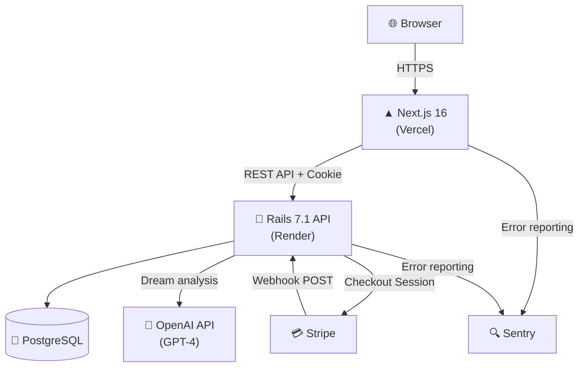
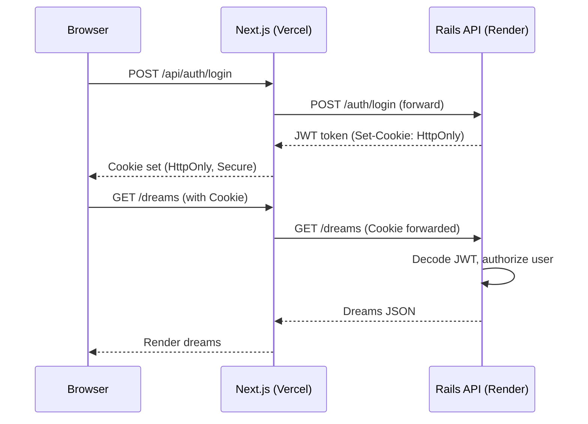
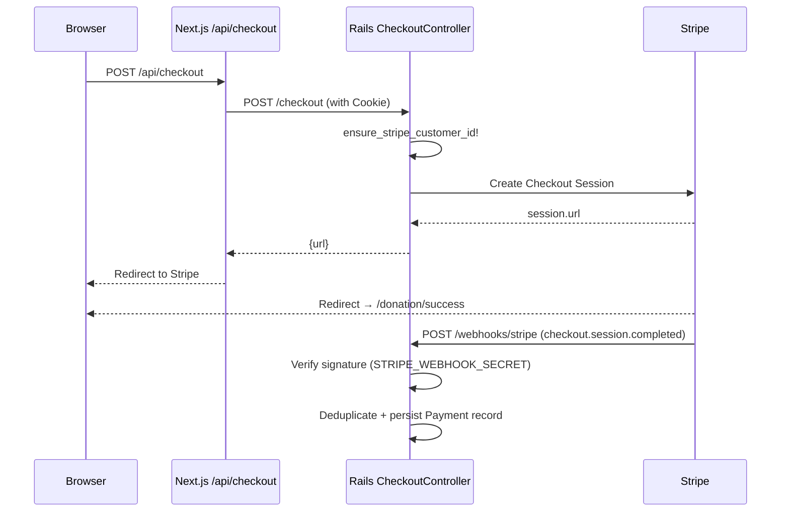

# ユメログ — AI Dream Journal

> **毎朝の夢を、AIが分析・言語化してくれるセルフケア日記アプリ**
> *An AI-powered dream journal that captures, analyzes, and visualizes your inner world.*

[](https://github.com/isekaisaru/dream-journal-app/actions/workflows/e2e-test.yml)
[](https://github.com/isekaisaru/dream-journal-app/actions/workflows/backend-test.yml)
[](https://github.com/isekaisaru/dream-journal-app/actions/workflows/backend-test.yml)
[](https://dreamjournal-app.vercel.app)
[](LICENSE)

**🌐 本番URL:** https://dreamjournal-app.vercel.app

---

## Table of Contents

- [Tech Stack](#tech-stack)
- [Features](#features)
- [Architecture](#architecture)
- [Getting Started](#getting-started)
- [Environment Variables](#environment-variables)
- [Running Tests](#running-tests)
- [CI/CD](#cicd)
- [Author](#author)

---

## Tech Stack

### Frontend


### Backend


### AI / Payment / Monitoring


### Infrastructure / DevOps


### Testing


---

## Features

### 夢の記録 — Dream Logging
テキストで夢を記録し、感情タグを付けて保存。キーワード・日付・タグによる絞り込み検索と月別アーカイブに対応。

> 📸 *Screenshot placeholder — `docs/screenshots/dream-log.png`*

---

### AI分析 — AI Dream Analysis
OpenAI GPT-4 が夢の本文を分析し、テキスト要約・感情ラベルを自動生成。隠れた感情パターンを可視化するセルフケアツールとして機能。

> 📸 *Screenshot placeholder — `docs/screenshots/ai-analysis.png`*

---

### 認証 — JWT + HttpOnly Cookie Auth
メール登録・ログイン・ログアウト・パスワードリセットをサポート。JWT トークンは HttpOnly Cookie に格納し、XSS 経由のトークン漏洩を防止。

> 📸 *Screenshot placeholder — `docs/screenshots/auth.png`*

---

### 決済 — Stripe Checkout / Webhook
アプリへの寄付機能を Stripe Checkout で実装。Webhook 署名検証・冪等処理・`client_reference_id` によるユーザー照合など、本番グレードの堅牢な決済フローを構築。本番環境での決済完了を確認済み。

> 📸 *Screenshot placeholder — `docs/screenshots/donation.png`*

---

### テスト整備 — Testing
- **Playwright E2E:** smoke テストと寄付フローをブラウザ自動テストでカバー
- **RSpec:** リクエストスペック中心に API 動作を網羅的に検証
- **Jest:** フロントエンドのユーティリティ・コンポーネントをユニットテスト
- **SimpleCov:** バックエンドのコードカバレッジを計測・CI で閾値管理

---

## Architecture

### System Overview（全体構成）



---

### Authentication Flow（JWT認証フロー）



---

### Payment Flow（Stripe決済フロー）



---

## Getting Started

### Prerequisites

- Docker Desktop 24+
- Docker Compose v2
- Make (macOS: pre-installed)

### Quick Start (Docker)

```bash
git clone https://github.com/isekaisaru/dream-journal-app.git
cd dream-journal-app
cp backend/.env.example backend/.env
# Fill in required values in backend/.env (see Environment Variables below)
make dev-up
```

| Service | URL |
|---|---|
| Frontend | http://localhost:3000 |
| Backend API | http://localhost:3001 |
| PostgreSQL | localhost:5432 |

### Useful Make Commands

| Command | Description |
|---|---|
| `make dev-up` | Start all services (background) |
| `make dev-down` | Stop and remove containers |
| `make dev-logs` | Stream combined logs |
| `make health` | Health check for both services |
| `make db-setup` | Run migrations + seed |
| `make clean` | Prune unused Docker resources |

---

## Environment Variables

### Backend (`backend/.env`)

| Variable | Description | Required |
|---|---|---|
| `RAILS_MASTER_KEY` | Rails credentials master key | ✅ |
| `SECRET_KEY_BASE` | Rails session encryption key (`rails secret`) | ✅ |
| `JWT_SECRET_KEY` | JWT signing key (`openssl rand -hex 64`) | ✅ |
| `POSTGRES_PASSWORD` | PostgreSQL password (16+ chars recommended) | ✅ |
| `FRONTEND_URL` | Stripe success/cancel redirect base URL | ✅ |
| `STRIPE_SECRET_KEY` | Stripe API secret key (`sk_test_...`) | ✅ |
| `STRIPE_WEBHOOK_SECRET` | Stripe webhook signature secret | ✅ |
| `OPENAI_API_KEY` | OpenAI API key for dream analysis | Optional |

### Frontend (`frontend/.env.local`)

| Variable | Description |
|---|---|
| `NEXT_PUBLIC_API_URL` | Public backend URL (used in Vercel production) |
| `INTERNAL_API_URL` | Internal backend URL for server-side calls |

> ⚠️ **Never commit secret values.** Use `.env.example` as a template and only set actual values in your local `.env` files.

---

## Running Tests

### Backend (RSpec + SimpleCov)

```bash
cd backend
bundle exec rspec
```

### Frontend (Jest)

```bash
cd frontend
yarn test
```

### E2E (Playwright)

```bash
# Requires the app to be running (make dev-up)
cd frontend
yarn e2e
```

### Stripe Webhook (Local)

```bash
# Terminal 1: Forward Stripe events to local server
stripe listen --forward-to localhost:3001/webhooks/stripe

# Terminal 2: Trigger test event
stripe trigger checkout.session.completed
```

Test card: `4242 4242 4242 4242` / any future date / any CVC

---

## CI/CD

GitHub Actions runs automatically on every push and pull request to `main`.

### E2E Tests (`.github/workflows/e2e-test.yml`)

1. Install Node.js 20 + Playwright browsers
2. Build the Next.js app
3. Start the production server
4. Run `e2e/smoke.spec.ts` and `e2e/donation.spec.ts` via Playwright

### Backend Tests (`.github/workflows/backend-test.yml`)

1. Spin up PostgreSQL 14 service container
2. Set up Ruby 3.3 with bundler cache
3. Run `bundle exec rspec`
4. SimpleCov generates coverage report; CI enforces minimum threshold

### Quality Gates

| Check | Tool | Status |
|---|---|---|
| E2E Browser Tests | Playwright | Auto on push/PR |
| Backend Unit/Request Tests | RSpec | Auto on push/PR |
| Frontend Unit Tests | Jest | `yarn test` |
| Code Coverage | SimpleCov | Threshold enforced in CI |
| Error Monitoring | Sentry | Always-on in production |

---

## Technical Highlights

### 1. Production-Grade Payment Flow
`ensure_stripe_customer_id!` で既存 Stripe 顧客の再利用・削除済み顧客の再作成を自動化。`client_reference_id` による user 解決 + email・`stripe_customer_id` でのフォールバックで、決済の完全性を担保。本番環境で決済完了を確認済み。

### 2. Observability by Design
`PaymentsObservability` サービスで Webhook イベントの構造化ログと KPI カウンターを統一管理。`[PaymentsKPI]` ログで障害時の素早いトリアージを実現。障害対応手順は [`docs/runbook-payments.md`](docs/runbook-payments.md) として Runbook 化。

### 3. Security in Depth
- JWT を HttpOnly Cookie に格納（XSS によるトークン漏洩を防止）
- Stripe Webhook の署名検証（`Stripe::Webhook.construct_event`）で偽リクエストを排除
- CORS を本番ドメインのみに厳格設定
- Dependabot アラートを体系的に優先度分類し、25件以上を解消

### 4. Cross-Domain Architecture
フロントエンド（Vercel）とバックエンド（Render）を別ドメインで分離運用。Cookie の `SameSite` / `Secure` 設定、CORS ヘッダー、Stripe リダイレクト URL のすべてをクロスドメイン前提で設計。

---

## Project Structure

```
.
├── frontend/               # Next.js App Router
│   ├── app/                # Pages & API route handlers
│   ├── __tests__/          # Jest unit tests
│   └── e2e/                # Playwright E2E tests
├── backend/                # Rails 7.1 API
│   ├── app/controllers/    # API controllers (auth, dreams, checkout, webhooks)
│   ├── app/services/       # PaymentsObservability, etc.
│   └── spec/               # RSpec tests (requests, models, services)
├── docs/
│   ├── runbook-payments.md # Payment incident runbook
│   └── release-checklist-payments.md
├── docker-compose.yml
├── docker-compose.dev.yml
└── Makefile
```

---

## Author

**Tyougorou** — Career changer: Logistics Manager → Full-Stack Engineer

- 1+ year of solo development with continuous daily commits
- Built and shipped a production-ready full-stack app with real payment processing
- Focused on **Reliability**, **Security**, and **Observability**

---

## License

[MIT](LICENSE)
