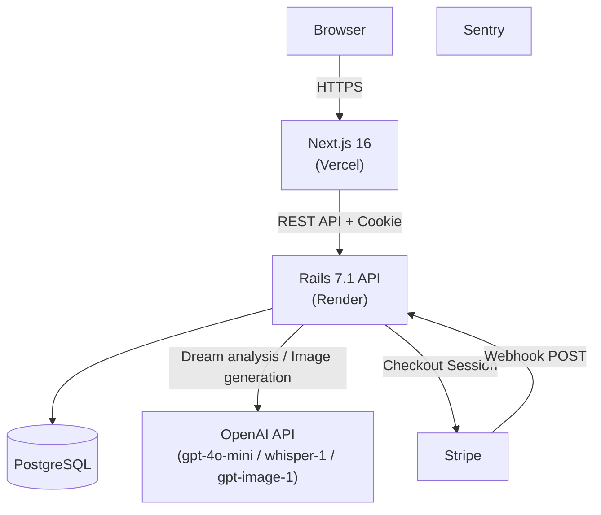

# 🌙 ユメログ — AI Dream Journal

**「言葉にならない子どもの夢や感情を、家族で楽しく記録・共有したい」** という課題から生まれた家族向け夢記録アプリです。
夢の内容を記録すると、OpenAI API が分析文と感情タグを返し、言葉の発達段階にある子どもの気持ちを家族で振り返るきっかけを作ります。

[](https://github.com/isekaisaru/dream-journal-app/actions/workflows/e2e-test.yml)
[](https://github.com/isekaisaru/dream-journal-app/actions/workflows/backend-test.yml)
[](https://dreamjournal-app.vercel.app)

**🌐 本番URL:** https://dreamjournal-app.vercel.app

## 概要

ユメログは、夢の記録・AI 分析・感情タグの可視化・家族向けのやさしい UI を組み合わせた Web アプリです。
フロントエンドは Next.js 16、バックエンドは Rails 7.1 API を採用し、認証、AI 連携、寄付決済、監視、テストまでを個人開発で一貫して構築しています。

技術選定では「モダンだから」ではなく、家族が毎日迷わず使える UX と、継続運用しやすい構成になるかを重視しています。

---

## 1. 解決する課題とプロダクト体験

### 夢の記録と AI 分析

子どもでも扱いやすいよう、ひらがなを多めに使った表現やシンプルな入力導線を意識しています。
記録した夢は OpenAI API（デフォルト `gpt-4o-mini`）で分析し、短い解釈文と感情タグを返します。使用モデルは `OPENAI_CHAT_MODEL` 環境変数で切り替え可能な設計にしており、本番挙動を変えずにコスト・品質の比較検証ができます。日々の夢を単なるメモで終わらせず、親子の会話やセルフケアのきっかけに変えることを狙っています。

### 音声入力による夢の記録

Whisper API を使った音声録音→テキスト変換→分析の一連フローを実装しています。
「朝起きたばかりで文字を打つのが面倒」という場面に対応し、録音ボタン一つで夢を記録できます。

### gpt-image-1 による夢のビジュアル化

夢の内容や AI 分析結果をもとに OpenAI の画像生成モデル（gpt-image-1）で画像を生成し、夢の世界をビジュアルで表現できます。
月次 31 枚上限（`check_monthly_image_limit`）でコストを管理し、Rack::Attack による追加のレート制限も設けています。
2026 年 5 月廃止予定だった dall-e-3 から gpt-image-1 へ移行済みで、`b64_json` レスポンスを直接 DB に保存することで期限切れ URL の問題を解消しています。

### 月次サマリーと統計

月別アーカイブページでは、その月の記録数・記録日数・感情 Top 3 などの統計をまとめて表示します。
連続記録のストリークバッジも用意し、日々の記録継続を楽しめる仕組みを取り入れています。

### 認証・寄付・月額課金

認証は JWT を HttpOnly Cookie で扱い、フロントエンドとバックエンドを分離した構成でも安全にセッションを維持できるようにしています。

決済は2種類の Stripe フローを実装し、いずれも本番稼働済みです。

- **寄付（一回払い）**: Stripe Checkout → `checkout.session.completed` Webhook → Payment 永続化
- **プレミアム月額課金（¥500/月）**: Stripe Subscription → Webhook 3イベント（`checkout.session.completed` / `invoice.payment_succeeded` / `customer.subscription.deleted`）→ `users.premium` フラグ更新
- **Stripe Billing Portal**: 解約・カード変更・請求履歴をホスト型ポータルに委譲し、PCI 対応の負担なく会員管理を実現

---

## 2. システムアーキテクチャと技術選定



### この構成を選んだ理由

- **フロントエンド: Next.js (App Router)**
  毎日使うアプリとして、初期表示の軽さと操作感の両立を重視しました。Server / Client Components を使い分けつつ、インタラクティブな UI は Framer Motion で補っています。
- **バックエンド: Rails API**
  認証、AI 連携、決済、Webhook 処理のようなドメインロジックを、短いサイクルで安全に改善しやすい構成として採用しました。RSpec による回帰確認もしやすい点を重視しています。
- **認証設計: JWT + HttpOnly Cookie**
  XSS 耐性を意識し、トークンをブラウザの JavaScript から直接触らせない構成にしています。クロスドメイン環境では Vercel 側の API 経由で Cookie を安定して扱えるようにしています。
- **インフラ: Vercel / Render**
  インフラ運用を過度に抱えず、機能改善と UX 検証に集中しやすいフルマネージド構成を選びました。

---

## 3. 設計・実装上の工夫

### ① 利用者フィードバック前提の UX 改善

「ひらがな中心の表示」「夢詳細の閲覧モードと編集モードの分離」「パスワード可視化トグル」「ライト / ダークモード切り替え」など、使いながら分かりにくかった点を小さく改善してきました。

- **パスワード強度バー**: 登録フォームに 弱い / 普通 / 強い の3段階インジケーターを追加。英字・数字・記号の組み合わせと文字数に応じてリアルタイムでフィードバックし、入力ミスを事前に防ぎます。
- **Trial UX 改善**: トライアルページに「残りAI分析: ○回」バッジを常時表示し、上限到達時は登録を促すアップグレードカードを表示。ユーザーが価値を体験してから自然に登録に進める導線を整えました。

個人開発でも変更を積み重ねやすいよう、Jest・RSpec・Playwright を併用して回帰確認しやすい状態を保っています。

### ② ガイドキャラクター「モルペウス」による画面統一

夢の番人キャラクター「モルペウス」を全11画面にそれぞれ配置し、アプリ全体のトーンを統一しています。
`MorpheusImage` コンポーネントがバリアント（`home` / `analysis` / `login` など）に応じた画像を切り替え、画像読み込みエラー時は SVG フォールバックで表示を保証します。
variant 変更時にエラー状態を `useEffect` でリセットすることで、画面遷移をまたいだ状態リークも防いでいます。

### ③ Value-First Onboarding — ログイン前でもアプリ体験を提供

未ログインユーザーを即座に `/login` へリダイレクトするのではなく、ページ自身が `MorpheusLoginRequired` コンポーネントでやさしく案内する設計にしています。
バックエンドの API 認証は維持したままフロントの導線を緩和することで、新規ユーザーがアプリの価値を感じてからアカウント登録できる流れを作っています。

さらに `/trial` ページでは、アカウント登録なしに AI 分析を最大3回体験できるトライアルフローを提供しています。初回のボタン押下時にバックエンドでトライアルアカウントを自動生成し、分析結果をその場で確認できます。残り分析回数のカウントダウン表示と、上限到達時のアップグレード誘導カードを組み合わせることで、「体験 → 価値実感 → 登録」の自然な流れを設計しています。

### ④ 多対多リレーションとレガシーデータ共存

夢と感情の関係は多対多で表現しています。さらに、AI 分析結果の保存形式が変わった後も既存データを壊さず扱えるよう、表示側で新旧フォーマットを吸収する実装にしています。

### ⑤ 監視・セキュリティ・レート制限を後回しにしない

Sentry をフロントエンドとバックエンドの両方に導入し、本番での例外や不安定な挙動を検知しやすくしています。
加えて、CORS 設定、HttpOnly Cookie、環境変数管理のほか、Rack::Attack によるレート制限（登録・分析 API・画像生成を個別に制御）を整備しています。
パスワードポリシーはバックエンドのモデルバリデーションとフロントの入力チェックを一致させ、「8文字以上・英字と数字を各1文字以上含む」を二重に保証しています。登録フォームには3段階の強度バーをリアルタイム表示し、入力中にポリシー充足状況を視覚的にフィードバックします。

### ⑥ Stripe 決済フローの堅牢化

寄付（一回払い）と月額サブスクリプション（¥500/月）の2フローを実装し、いずれも本番稼働済みです。

共通の設計方針として、`ensure_stripe_customer_id!` による顧客再利用、Webhook 署名検証（`STRIPE_WEBHOOK_SECRET`）、`ProcessedWebhookEvent` による重複イベント排除、`PaymentsObservability` による構造化ログを整備しています。

Subscription フローでは `client_reference_id` → `stripe_customer_id` → `email` の3段階フォールバックでユーザーを解決し、解約時には `customer.subscription.deleted` を受けて `premium` フラグを安全に降ろす設計にしています。
一次切り分け用に [`docs/runbook-payments.md`](docs/runbook-payments.md) も用意し、機能実装だけでなく運用時の対応手順まで残しています。

### ⑦ 日時処理の一元化とバグ予防

日本時間（JST）での日付処理を `lib/date.ts` に集約し、`toLocaleString("ja-JP")` が返す「2026年」のような日本語文字列が URL パラメータに混入するバグを防いでいます。
`en-CA` ロケールで `YYYY-MM-DD` 形式を取得し、`.slice(0,7)` で月キーを生成することで、Vercel（UTC 環境）でも JST 基準の月グループが正確に機能します。

---

## 4. 開発の記録（技術記事）

実装の背景・設計判断・はまりポイントを Zenn にまとめています。

- 📝 [個人開発で Stripe Webhook を本番稼働させた全記録 — 署名検証・冪等性・3段階ユーザー解決](https://zenn.dev/isekaisaru/articles/2e4860a296799b)
- 📝 [個人開発で gpt-image-1 の 502 エラーを直した記録 — タイムアウト3層設計の全容](https://zenn.dev/isekaisaru/articles/656e5186401467)

---

## 5. 今後の展望・課題

- 画像生成・AI 分析の利用量に連動したプレミアムプラン設計と課金導線の整備
- N+1 の解消やクエリ改善など、データ量増加を見据えたバックエンド最適化
- 自動テストの拡充と、より安全な CI/CD の継続改善
- INP の計測と改善（PageSpeed Insights で現状把握後に着手予定）
- OpenAI モデルの比較検証（`OPENAI_CHAT_MODEL` 環境変数を活用して gpt-5-mini / gpt-5-nano の品質・コストを評価）

---

## Tech Stack & Project Info

<details>
<summary>利用技術</summary>

- **Frontend**: Next.js 16, React 18, TypeScript, Tailwind CSS, Framer Motion
- **Backend**: Ruby on Rails 7.2 (API mode), Ruby 3.3, PostgreSQL
- **Testing**: Playwright, RSpec, Jest
- **AI / External Services**: OpenAI API (`gpt-4o-mini`, `whisper-1`, `gpt-image-1`), Stripe Checkout / Subscription / Billing Portal, Sentry
- **Security**: Rack::Attack (rate limiting), JWT + HttpOnly Cookie, CORS
- **DevOps**: Vercel, Render, Docker Compose, GitHub Actions
</details>

<details>
<summary>ローカル開発環境の立ち上げ</summary>

```bash
git clone https://github.com/isekaisaru/dream-journal-app.git
cd dream-journal-app
cp backend/.env.example backend/.env
make dev-up
```

| Service | URL |
|---|---|
| Frontend | http://localhost:3000 |
| Backend API | http://localhost:3001 |
| PostgreSQL | localhost:5432 |
</details>

<details>
<summary>CI/CD</summary>

GitHub Actions で `main` への Push / PR 時に Playwright、RSpec、Jest を実行し、主要フローの回帰を検知できるようにしています。

**Playwright E2E カバレッジ（CI 実行分）**

CI（GitHub Actions）では認証不要なシナリオを自動実行しています。

| シナリオファイル | カバー内容 |
|---|---|
| `smoke.spec.ts` | アプリ起動・ログインリンク表示 |
| `donation.spec.ts` | 寄付フロー・Stripe Checkout 遷移 |
| `dream-detail-flow.spec.ts` | 夢詳細表示・編集モード切り替え |

認証が必要なシナリオ（`home-flow.spec.ts`、`month-summary-flow.spec.ts`）および登録・トライアルフロー（`registration-flow.spec.ts`、`trial-flow.spec.ts`）はローカル環境で実行します。
</details>

---

## Author

**Tyougorou**
物流・現場マネジメント経験を経て、手触りのあるソフトウェアで課題解決を行うため Web 開発技術を習得。要件定義から実装、デプロイ、運用改善まで一貫して取り組んでいます。
